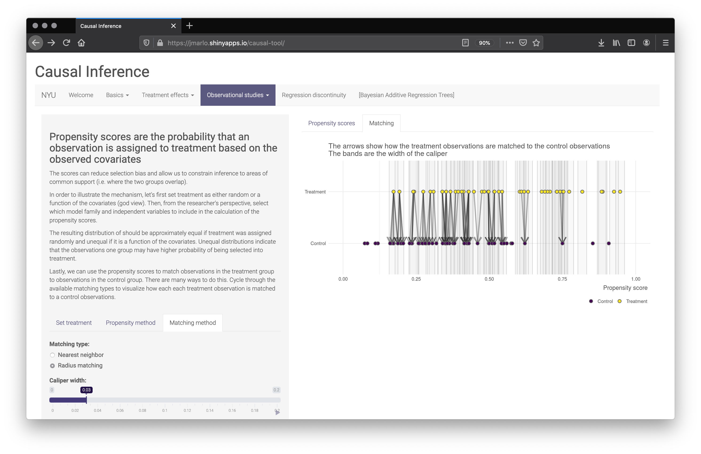

# Interactive tool for learning causal inference
#### Joe Marlo, jpm770

## Introduction
The goal of the tool is to help users build intuition for key causal inference concepts via visualization. The tool attempts to follow a 'first principles' path by first describing the fundamental problem of causal inference and why randomization is often necessary. From there, visualizations of treatment effects, propensity scores, and regression discontinuity are included. All center around interactive components and most invite the user to experiment with the data generating process (DGP) to further understand the concepts.

The tool is currently hosted on my Shinyapps.io server and can be accessed [here](https://jmarlo.shinyapps.io/causal-tool/). All code can be found on [Github](https://github.com/joemarlo/causal-tool) and is provided with a GNU General Public License v3.0 guaranteeing free public and private use and distribution.

<!-- insert homepage screenshot -->

## Basics

#### Fundamental problem of causal inference

The first page sets the foundation for why causal inference is necessary. It illustrates a simple example of an experiment involving heart disease. Directed acyclic graphs (DAGs) help formalize the concepts visually. The conclusion of the page includes a mathematical formalization to baseline users in the notation.

#### Randomization

The rationale for randomization can be easily overlooked in an advanced causal inference course so it is important to remind users why it is referred to as the gold standard. This page invites users to 'observe' two variables via plotting and then manually assign the observations to either control or treatment group. Univariate density plots of both observed and unobserved variables then populate and the resulting balance of the two groups can be visually compared. Users should then randomize the treatment groups using the button and then see how the two groups compare.

The underlying data is generated to include correlations so it is difficult to manually balance the groups. n is kept small so the manual assignment process does not become tedious. The correlations of the variables are:

|                    | Cholesterol LDL| Cholesterol HDL|   Age| Genetic disposition| Packs per day| Exercise per week|
|:-------------------|---------------:|---------------:|-----:|-------------------:|-------------:|-----------------:|
|Cholesterol LDL     |            1.00|            0.79|  0.44|                0.19|          0.52|             -0.45|
|Cholesterol HDL     |            0.79|            1.00|  0.46|                0.26|          0.56|             -0.42|
|Age                 |            0.44|            0.46|  1.00|               -0.03|          0.16|             -0.09|
|Genetic disposition |            0.19|            0.26| -0.03|                1.00|          0.01|             -0.06|
|Packs per day       |            0.52|            0.56|  0.16|                0.01|          1.00|             -0.46|
|Exercise per week   |           -0.45|           -0.42| -0.09|               -0.06|         -0.46|              1.00|

## Treatment effects

#### Estimating treatment effects

The treatment effects section starts with illustrating the basic estimators of causal inference: SATE and regression-based. The user is greeted with a basic introduction to the concepts and the core of the section focuses on the animated illustrations of the estimation process. The DGP is adjustable and the animations rebuild to the adjusted parameters. Pseudocode is provided under the DGP so the user can reproduce the data themselves.

#### Efficiency

The efficiency of both SATE and regression are illustrated through simulation based methods. Both the randomization and sampling distribution is visualized. The DGP is also adjustable.

#### Bias

Similar to efficiency, bias is illustrated using simulation based methods. The randomization and sampling distributions are included along with an adjustable DGP. Additionally, a table quantifying the bias, efficiency, and RMSE of both the SATE and regression method is included. Within the DGP, the user can adjust the proportional split of blocks and conditional probabilities that define the randomized block design.

 

## Propensity scores and matching

Propensity scores page focuses on illustrating matching concepts. First, treatment can be assigned by the user either randomly or dependent on various variables. Second, the scores can be formulated using logit, probit, or GAM models. The density plots update to show how the propensity scores per the treatment and control groups compare. Most importantly, the illustration under the 'Matching' tab visualizes nearest neighbor (NN) and radius matching. The user can select with or without replacement for NN and caliper width for radius. The plot updates in real time so it is easy to see how observations are being matched across the methods.

The underlying data is the same as the Randomization page.

 

## Regression discontinuity

Regression discontinuity lends itself particularly well to interaction and visualization. The user is presented with both analysis tools and the data generation process. The analysis tools estimate the treatment effect under various different models and bandwidths. The underlying implication is that many models do not fit the data well and it is easy to fit the wrong one when the DGP is unknown. Both 'researcher POV' and 'god POV' are included so the user can conceptualize the differences in the known and unknown observations.

 

 
 

## Conclusion

The original goal was to illustrate the basic concepts of causal inference. This was achieved but with some minor caveats. During the process, it became evident that the most important function to learning many of the concepts is having the ability to control the underlying data generation process, similar to the simulation homework assignments. Combining the ability to control the DGP with animation is computationally expensive and programmatically challenging. As such, the DGP process was privileged over sleeker animations where necessary.

Many of the concepts still do illustrate well. The matching methods and the regression discontinuity design are particularly insightful and are standouts for pedagogical use.

#### Next steps

The tool currently covers a wide breadth of concepts but is not comprehensive of the topics taught in the course. In an ideal world, a few more concepts would be included: notably a more prescriptive introduction to observational studies and illustrations of Bayesian Additive Regression Trees - which is currently being implemented with the help of George Perrett.

In total, I would like to expand on the following:  

* A new page summarizing the key assumptions of causal inference.  
* A new page covering observational studies. It would introduce observational studies and focus on the problem of overlap via the data generation process in a similar manner as the regression discontinuity page. Balance and IPTW concepts should also be covered.  
* A new page on Bayesian Additive Regression Trees. This would integrate George's work into the tool.  
* A new page on instrumental variables.  
* Adjustments to the treatment effects page that further visualize the simulation work:  
  * Animating the simulations so values "fall down" and accumulate into histograms.  
  * Adding the ability to include just an indicator for treatment for regression or to include both the treatment indicator and other pre-treatment variables.    
* Additions to the regression discontinuity page:  
  * Enabling the ability to specify different functional forms across the left and right sides of the cutoff.  
  * Including different bandwidths across the left and right sides of the cutoff.  
  * Additional DGP that is difficult to model (e.g. an unwieldy polynomial).  

